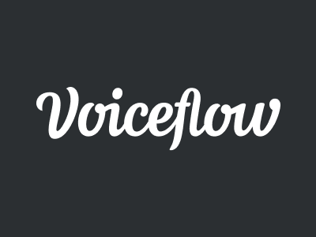

# Voiceflow API examples

Getting started with the [Voiceflow API](https://www.voiceflow.com/developer) has never been easier.
Use one of our examples to get setup in a matter of minutes:

- [Node.js](./nodeJS/README.md) - A Node.js app that lets you interact with your project from the terminal
- [Deno](./deno/README.md) - A Deno app that lets you interact with your project from the terminal
- [HTML and jQuery](./HTML/README.md) - A simple webpage that displays messages in your browser
- [Nim](./nim/README.md) - A Nim app that lets you interact with your project from the terminal
- [Rust](./rust/README.md) - A Rust app that lets you interact with your project from the terminal
- [Python](./python/README.md) - A Python app that lets you interact with your project from the terminal

Want an example that isn't listed?
[Open a GitHub issue](https://github.com/voiceflow/api-examples/issues/new) and we'll add it to the list.
